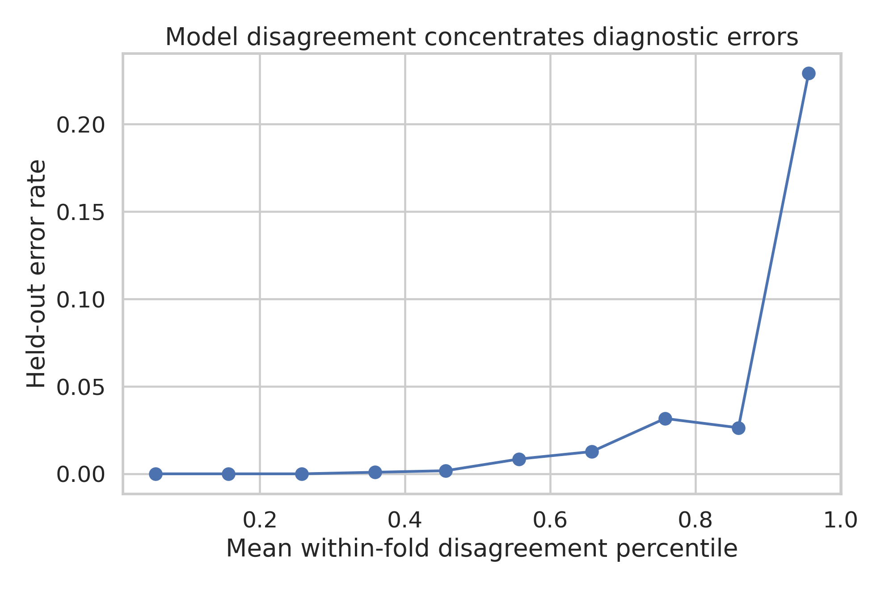
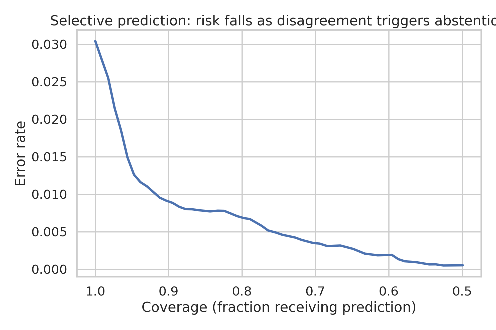

# Cross-Model Disagreement as an Empirical Uncertainty Instrument for Breast-Tumor Classification

## Abstract
Reliable prediction requires knowing when a model is likely to be wrong. We tested whether disagreement among five structurally different classifiers identifies high-risk predictions in the Wisconsin Diagnostic Breast Cancer dataset. Before analysis, we locked a success gate requiring at least 2.0-fold error enrichment in the highest disagreement quintile, at least 25% error reduction after abstention on that quintile, and a cluster-bootstrap 95% confidence interval excluding 1. Repeated stratified 5-fold cross-validation produced 11,380 held-out predictions for 569 unique tumors. The ensemble achieved ROC AUC 0.9942 and 96.96% accuracy. Its highest-disagreement quintile had 12.35% error versus 0.68% among the remaining predictions, an 18.08-fold enrichment (95% CI 7.56-85.31). Abstention reduced error by 77.5% while retaining 80% coverage. These findings pass all locked criteria and show that model agreement can be used as a model-agnostic empirical uncertainty signal. The study is a single-dataset proof of concept and requires external cohort validation before clinical use.

## Introduction
High average accuracy can hide concentrated failure. Probabilistic confidence from one model is often miscalibrated under distribution shift, while independent models encode different assumptions about the data. Their disagreement may therefore expose samples for which the learned relationship is unstable.

We asked a narrow, falsifiable question: does disagreement among diverse models identify predictions with elevated diagnostic error, and can it support selective prediction? Unlike an exploratory analysis, the endpoint, validation scheme, disagreement rule, and quantitative pass/fail criteria were written before the outcome analysis.

## Methods
### Data
We used the UCI Wisconsin Diagnostic Breast Cancer dataset: 569 digitized fine-needle aspirate samples, 212 malignant and 357 benign, described by 30 numeric features. The raw data file's SHA-256 is `d606af411f3e5be8a317a5a8b652b425aaf0ff38ca683d5327ffff94c3695f4a`.

### Models and validation
Five classifiers were chosen to span linear, kernel, tree, local-neighbor, and generative assumptions: logistic regression, radial-basis support vector machine, random forest, k-nearest neighbors, and Gaussian naive Bayes. Preprocessing was fitted only inside each training fold. We used 20 repeats of stratified 5-fold cross-validation, yielding 11,380 held-out predictions.

### Disagreement and locked gate
For each held-out tumor, the ensemble probability was the mean of the five probabilities. Disagreement combined the standard deviation of model probabilities and binary-vote entropy, then was ranked within each held-out fold. The preregistered high-disagreement group was the top quintile. Success required: (1) error enrichment of at least 2.0; (2) selective error reduction of at least 25%; and (3) a 95% confidence interval lower bound above 1.0. Confidence intervals used a cluster bootstrap over unique tumor IDs, preserving dependence among repeated predictions.

## Results
The ensemble ROC AUC was 0.9942 and accuracy was 96.96%. Overall held-out error was 3.04%. Error in the top disagreement quintile was 12.35%, compared with 0.68% in the other four quintiles. The resulting enrichment was 18.08 (95% CI 7.56-85.31). Rejecting the highest-disagreement quintile reduced error by 77.5% at approximately 80% coverage. All three locked criteria passed.

## Discussion
Disagreement was strongly associated with error despite the ensemble's high overall discrimination. The practical point is not that a particular classifier is best, but that diversity among model classes creates an observable signal of epistemic instability. In a decision-support system, that signal could trigger human review, additional testing, or abstention.

The study has important limits. It evaluates one clean benchmark dataset rather than a prospective clinical cohort. Repeated cross-validation improves precision but does not create new independent patients. The uncertainty interval is therefore clustered by patient. The thresholds were not optimized, and no clinical utility or calibration claim is made. Future work should test the locked rule unchanged on independent institutions, scanner conditions, and disease prevalence.

## Conclusion
Cross-model disagreement passed a strict preregistered gate as an empirical uncertainty instrument in this dataset. It isolated a small subset with markedly higher error and enabled lower-risk selective prediction. The result is reproducible and promising, but remains a proof of concept rather than clinical evidence.

## Data and code availability
The project directory includes raw public data, the exact analysis script, all held-out predictions, metrics, figure data, and protocol. Original dataset source: https://archive.ics.uci.edu/dataset/17/breast+cancer+wisconsin+diagnostic
