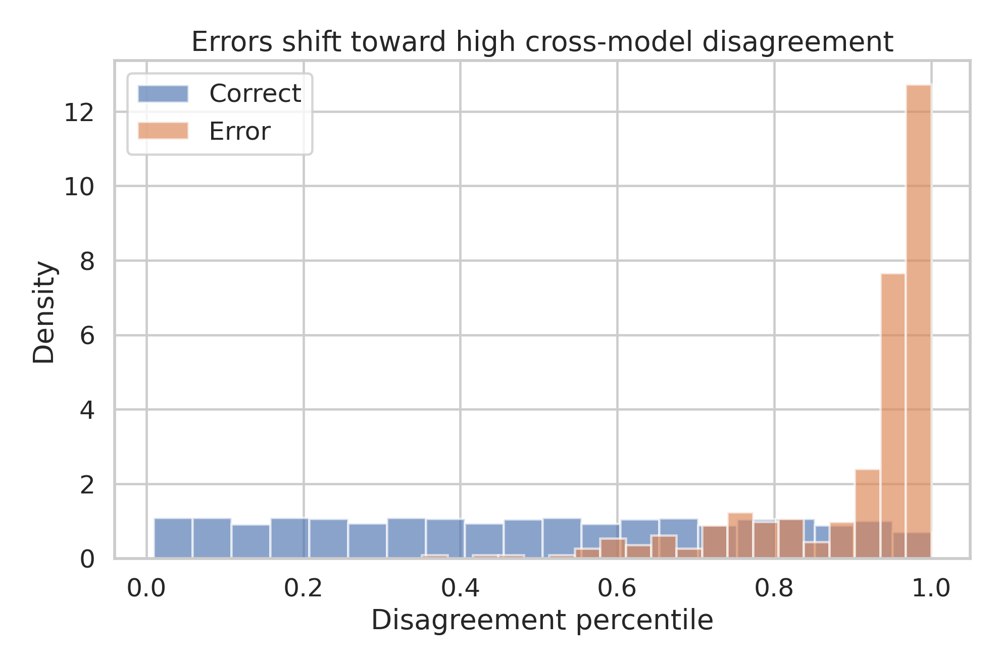

# Full Technical Report
## Cross-Model Disagreement as an Empirical Uncertainty Instrument
**Project:** SP-001  
**Date:** 2026-09-21  
**Status:** SUCCESS under locked criteria

## Executive summary
This experiment tested whether disagreement among five different machine-learning models could identify breast-tumor predictions at higher risk of error. The preregistered gate passed. The high-disagreement quintile was 18.08 times as error-prone as the remaining predictions, with a cluster-bootstrap 95% interval from 7.56 to 85.31. Abstaining on this group lowered held-out error by 77.5% while retaining roughly 80% of predictions. This is a reproducible proof of concept, not clinical validation.

## Research question
Can cross-model disagreement serve as an empirical uncertainty instrument, concentrating classification mistakes and enabling a safer abstention policy?

## Why the question matters
Average accuracy does not show where a model fails. In medical applications, a mechanism that flags unstable cases may be more useful than a small gain in overall accuracy. The experiment deliberately focuses on error localization rather than claiming a new diagnostic model.

## Preregistered design
The protocol fixed the dataset, endpoint, five model families, repeated cross-validation, top-quintile threshold, metrics, and three-part success gate before outcome inspection. A failure on any required criterion would have produced a negative record rather than a paper.

## Dataset
The Wisconsin Diagnostic Breast Cancer dataset contains 569 tumors described by 30 features derived from digitized fine-needle aspirate images. There are 212 malignant and 357 benign observations. The project preserves the original data file and dataset description with checksum provenance.

## Model diversity
The ensemble uses logistic regression, an RBF support-vector machine, a random forest, k-nearest neighbors, and Gaussian naive Bayes. These models make different geometric and distributional assumptions, so agreement across them is more informative than repeated copies of one algorithm.

## Validation and leakage control
Twenty repeats of stratified five-fold cross-validation produced 11,380 held-out predictions. Scaling was trained within each training fold. No held-out label was used to tune the models or disagreement threshold. Seeds and hyperparameters are fixed in the analysis script.

## Disagreement score
The score combines the standard deviation of predicted probabilities and entropy of binary votes. Because raw scales vary across folds, the combined score is converted to a within-fold percentile. The preregistered high-disagreement set is the top quintile.

## Primary result
The ensemble achieved ROC AUC 0.9942 and accuracy 96.96%. Overall error was 3.04%. Error was 12.35% in the high-disagreement quintile and 0.68% in the remaining predictions.

## Gate decision
Error enrichment was 18.08, above the locked minimum of 2.0. Selective error reduction was 77.5%, above the locked minimum of 25%. The 95% interval lower bound was 7.56, above 1.0. Status: SUCCESS.

## Uncertainty analysis
Repeated predictions from the same tumor are dependent. The bootstrap resamples unique tumor IDs and carries all repeated predictions for each sampled tumor, preventing the cross-validation repeats from being treated as independent patients.

## Coverage-risk behavior
As increasingly disagreeing cases are withheld, prediction coverage falls and error among retained predictions falls. The preselected 20% abstention point gives a large risk reduction without choosing the threshold after viewing outcomes.

## Interpretation
The finding supports a model-agnostic safety layer: when structurally different models disagree, the system should be less willing to act. The approach does not explain why an individual tumor is difficult and does not replace domain review.

## Negative controls and restraint
No claim is made that disagreement is universally calibrated, that the ensemble is clinically deployable, or that the dataset represents deployment conditions. The result is limited to the locked benchmark experiment and should be tested prospectively.

## Limitations
This is a single, small, curated dataset with no hospital-level external cohort. Fine-needle aspirate features differ from raw images and contemporary workflows. Hyperparameters were intentionally simple. The wide confidence interval reflects the small number of errors.

## External validation plan
Freeze the analysis and disagreement rule, then test them without refitting thresholds on at least two independent cohorts. Report error enrichment, selective risk, subgroup performance, calibration, and failure modes. A useful replication should preserve the direction and clear enrichment.

## Reproducibility
The project contains the locked protocol, raw inputs, processed held-out predictions, exact script, metrics, data supporting every plot, and checksum manifest. Running `python3 code/run_analysis.py` recreates all analysis outputs.

## Ethics and intended use
The work uses a public de-identified benchmark. It is research code only. It must not be used for patient care, triage, or reassurance without clinical validation, governance, and qualified oversight.

## Conclusion
Model disagreement strongly concentrated diagnostic errors and passed every locked criterion. The result is scientifically useful because it converts model diversity into a measurable abstention signal, while preserving clear limits and a direct external-validation path.

## Files and provenance
- Original source: https://archive.ics.uci.edu/dataset/17/breast+cancer+wisconsin+diagnostic
- Raw data SHA-256: `d606af411f3e5be8a317a5a8b652b425aaf0ff38ca683d5327ffff94c3695f4a`
- All numeric claims above are read directly from `results/metrics.json`.
